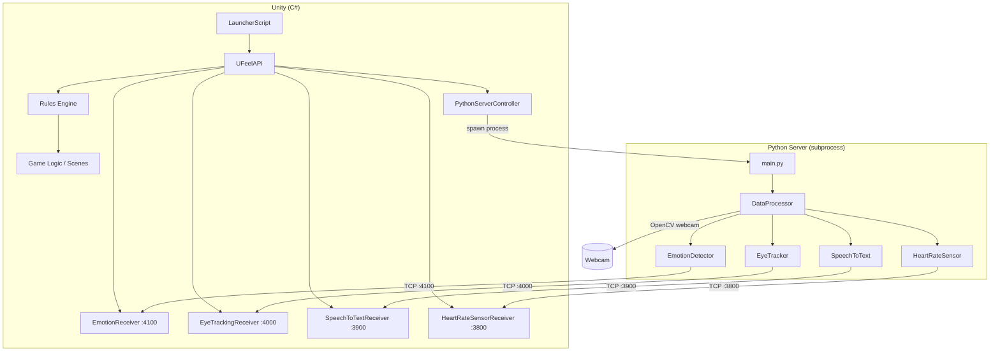
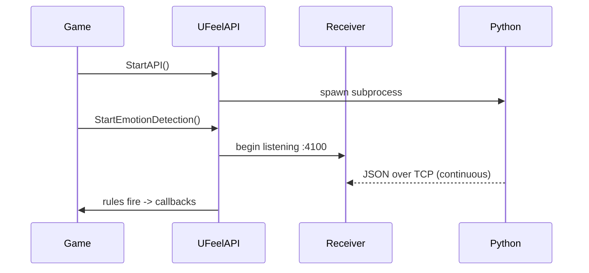

# Architecture

> [<- Back to README](README.md)

UFeel Testing Room is a Unity project demonstrating the **UFeel** biometric package. Unity spawns a Python server that processes webcam/sensor data and streams results back via TCP.

## Overview

## Key Components

### UFeel Package (`Packages/com.ufcorp.ufeel`)

| Component | Role |
|---|---|
| `UFeelAPI` | Singleton entry point. Starts/stops detectors, exposes data getters, manages rules. |
| `ClientBase` | Abstract TCP listener. Each receiver extends it to decode JSON messages on a dedicated thread. |
| `PythonServerController` | Spawns/kills the Python process from Unity's lifecycle. |
| `Rules Engine` | Condition->Action pairs evaluated every `Update()`. Supports one-shot and continuous rules. |

### Python Server (`PythonServer/`)

| Module | Role |
|---|---|
| `DataProcessor` | Main loop - reads webcam frames, dispatches to each detector. |
| `EmotionDetector` | MediaPipe-based facial emotion detection. |
| `EyeTracker` | Gaze direction estimation. |
| `SpeechToText` | Microphone transcription. |
| `HeartRateSensor` | rPPG heart-rate estimation from camera. |

### Testing Room (`Assets/Scripts/TestingRoom`)

First-person experience used to validate the UFeel package: room navigation, carousel, doors, and scene transitions driven by UFeel rules.

## Data Flow

**See also:** [API Reference](Packages/com.ufcorp.ufeel/Runtime/API.md) - [Setup Instructions](Documentation/TestingRoom/SetupInstructions.md)
