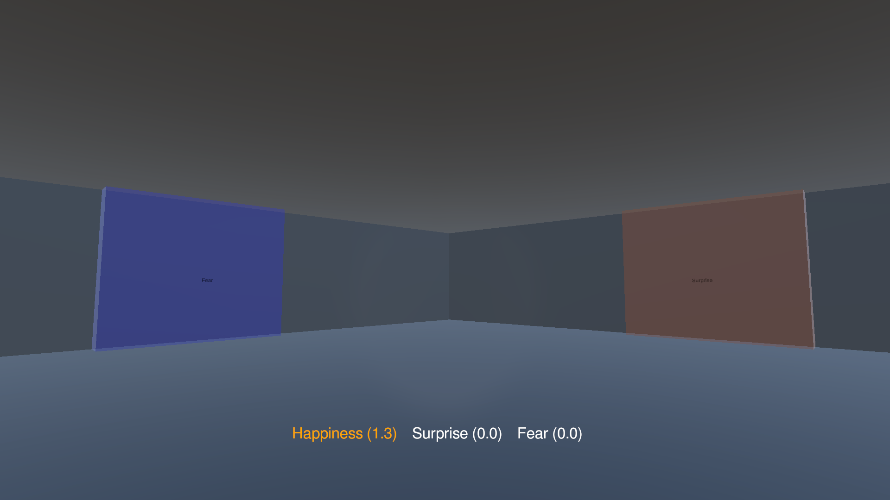

# Maze

> [<- Scene Reference](../../TestingRoom/Scenes.md)

## Role

Emotion-driven labyrinth experience.

## Gameplay

- The labyrinth is composed of multiple interconnected rooms.
- Each room contains between 2 and 4 fog doors.
- Entering a door attempts to move the player to the next room.
- Every door is associated with a specific emotion.
- The player must perform the correct emotion to unlock the appropriate path.
- Choosing the wrong emotion may prevent progression.

## Objective

Reach the final room and escape the labyrinth.

## Main Script

`MazeManager`
