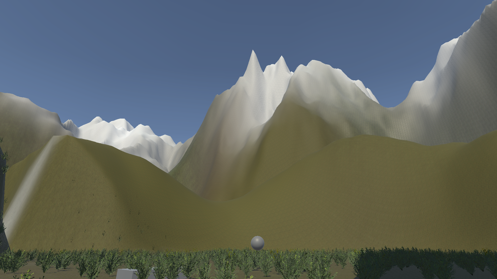

# Car

> [<- Scene Reference](../../TestingRoom/Scenes.md)

## Role

Vehicle navigation using eye tracking.

## Gameplay

- Eye movements control the vehicle direction.
- Looking left or right steers the vehicle.
- Keyboard controls remain available for movement:

  - **W**: Accelerate
  - **S**: Reverse
- The scene is designed to evaluate gaze-based navigation.

## Objective

Drive the vehicle and successfully navigate through the environment using eye tracking.

## Main Script

`VehicleController`

## Keyboard shortcuts

These keyboard shortcuts are available in all scenes:

| Key | Action |
| --- | --- |
| **W** | Move forward (in car) |
| **S** | Move backward (in car) |