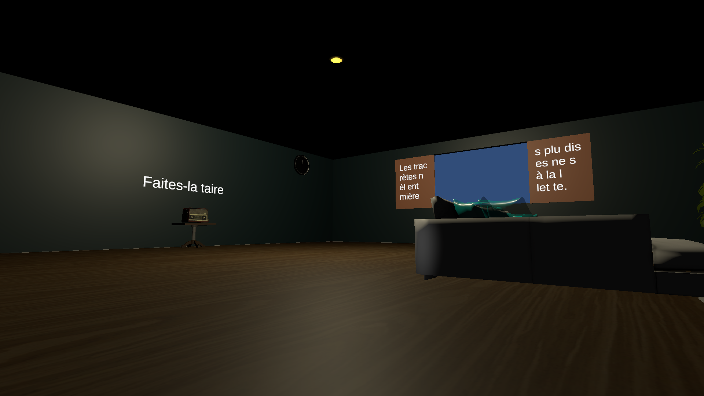

# EscapeRoom

> [<- Scene Reference](../../TestingRoom/Scenes.md)

## Role

Voice-controlled escape room experience.

## Gameplay

- The player interacts with the environment using spoken commands.
- Different actions must be performed in the correct order.
- Progress depends on successful speech recognition.

## Objective

Solve the room's challenges and escape using voice commands.

## Main Script

`SpeechManager`
